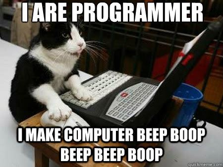

# MariHacks Hacker Booklet

**Welcome to the Hacker Booklet!** This booklet will help you prepare for MariHacks. Although the booklet is mainly oriented towards beginners, experienced hackers might also want to take a look.

This booklet contains short tutorials as well as numerous references to lead you in the right direction. Want to make a website but do not know where to start? Just jump to the [web development section](dive_in/web.md). Not sure if [machine learning](advanced/machine_learning.md) is the way to go? Read up on it in our booklet. Need help with APIs? We got you covered!

**Outline:**

* [The First Steps](first_steps/)
* [Dive Into Your Projects](dive_in/)
* [Implement Cooler Stuff!](advanced/)

